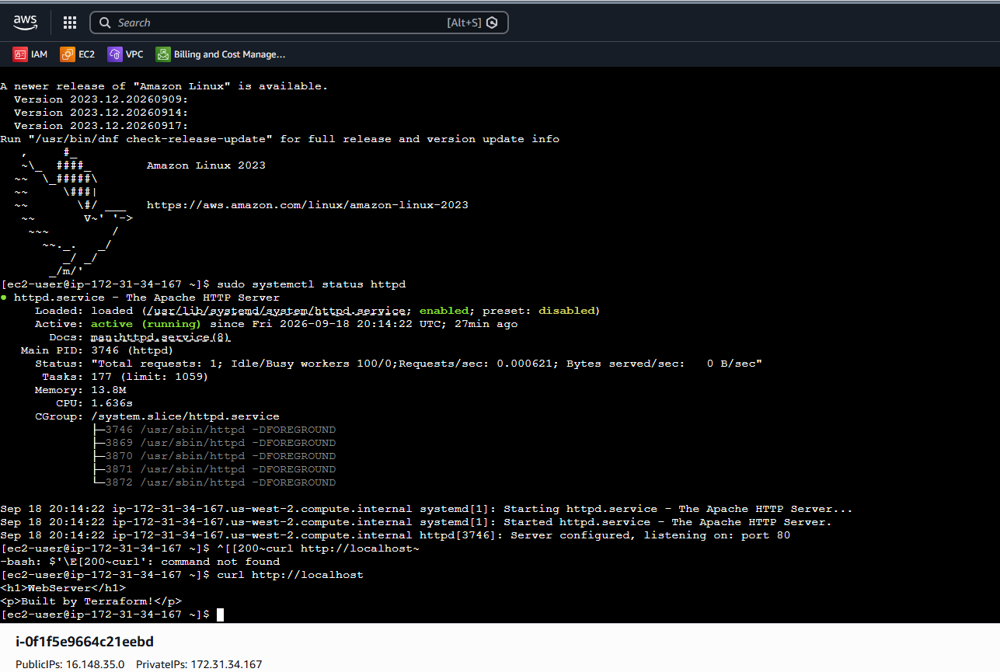
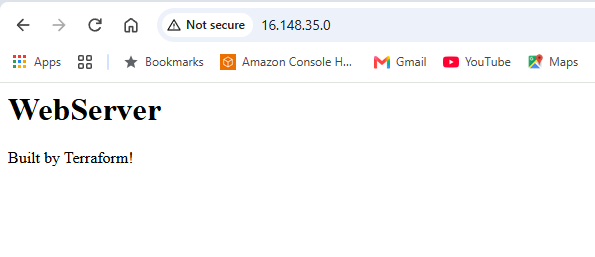

# **_Terraform_** AWS EC2 Project

Overview

This project demonstrates how to use Terraform to provision an Amazon EC2 instance on AWS using Infrastructure as Code (IaC).

Instead of manually creating an EC2 instance through the AWS Management Console, Terraform is used to define the infrastructure configuration in code and deploy it automatically.

Technologies
Terraform
Amazon Web Services (AWS)
Amazon EC2
Git
GitHub


# **Terraform AWS Web Server**

Overview

This project demonstrates how to use Terraform to automatically provision an AWS EC2 web server and configure its network access.

The infrastructure is created using Infrastructure as Code (IaC), allowing the AWS environment to be deployed consistently without manually configuring the EC2 instance through the AWS Management Console.

Technologies Used
Terraform
Amazon Web Services (AWS)
Amazon EC2
AWS Security Groups
Apache HTTP Server
Linux
Git
GitHub


## Troubleshooting

During deployment, the web server initially returned:

`ERR_CONNECTION_TIMED_OUT`

### Troubleshooting Process

I investigated the issue layer by layer:

1. **EC2 Instance**
    - Confirmed the instance was running.
    - Confirmed both EC2 status checks passed.
    - Confirmed the instance had a public IPv4 address.

2. **Network Configuration**
    - Verified the subnet was using a route table with an Internet Gateway.
    - Verified the Network ACL allowed inbound and outbound traffic.

3. **Security Group**
    - The Security Group initially allowed HTTP traffic on port 80 but did not allow SSH access for EC2 Instance Connect.
    - Added an SSH rule for TCP port 22 using the AWS EC2 Instance Connect managed prefix list.

4. **Apache Web Server**
    - Connected to the EC2 instance using EC2 Instance Connect.
    - Checked the Apache service:

   ```bash
   sudo systemctl status httpd
   


